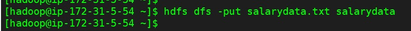
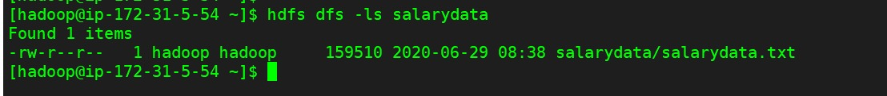
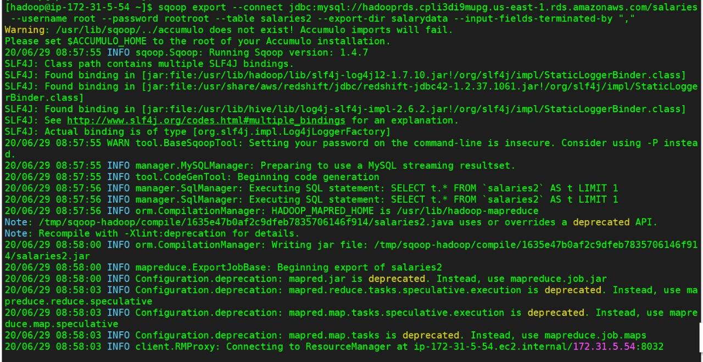
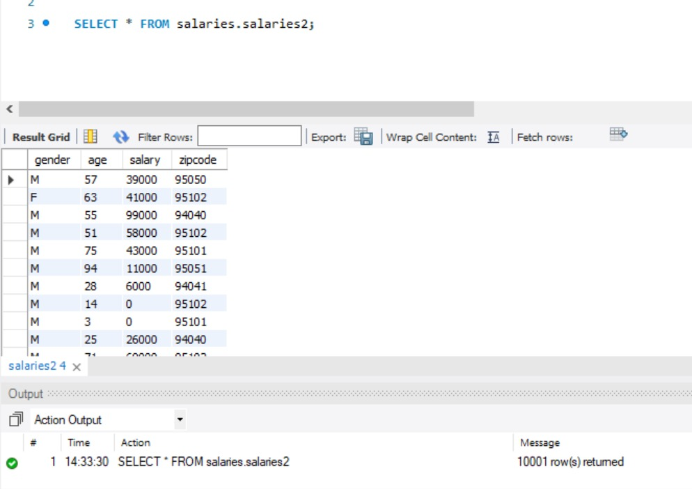

# LAB 3.1 -> Exporting HDFS Data to an RDBMS

***Objective -> Export data from HDFS into a MySQL table using Sqoop.***

***Pre-requisites -> Hadoop cluster on EMR should be up and running***

Following are the steps to be performed in this lab:-

1. Create a new hdfs directory using mkdir command with name salarydata

2. Put salarydata.txt into the salarydata directory in HDFS

3. Check whether the file is created on hdfs

4. Create a new Table in the Database as salaries2 using following sql command

*create table salaries2 (
gender varchar(1),
age int,
salary double,
zipcode int);*

5. Now export data from hdfs to database

6. Verify whether all records are been exported successfully

***Result -> You have now used Sqoop to export data from HDFS into a database table in MySQL.***
