# LAB -> Getting Started with Pig

***Objective -> Use Pig to navigate through HDFS and explore a dataset.***

***Pre-requisites -> Hadoop cluster on EMR should be up and running***

Following are the steps to be performed in this lab:-

1. View Raw Data
   1. SSH to your EMR cluster
   2. Unzip whitehouse_visits.zip

    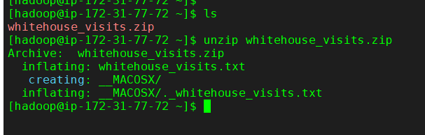

   3. View contents of this file

    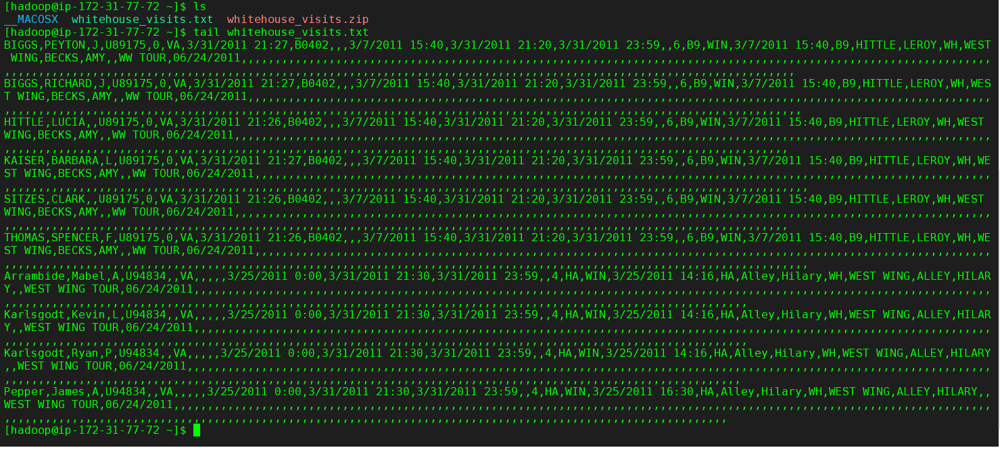

2. Load data into HDFS
    1. Start grunt shell

    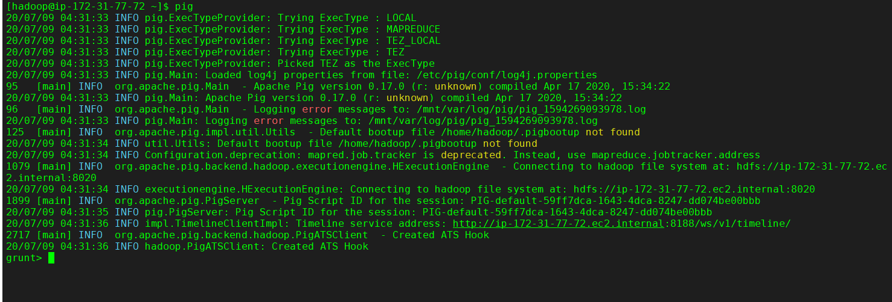

    2. Create new directory named whitehouse

    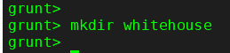

    3. Copy whitehouse_visits.txt file to this directory

    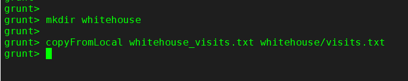

    4. Use ls command to verify whether file was successfully uplaoded

    

3. Define a Relation
    1. Use TextLoader to load visits.txt file. Define a LOAD relation 

    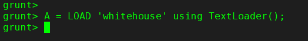

    2. Use 'Describe A'. You will notice that there is no schema present in A

    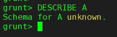

    3. Use LIMIT operator to define a new relation named A_limit that is limited to 10 records of A

    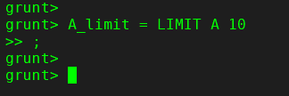

    4. Use DUMP operator to view A_limit relation

    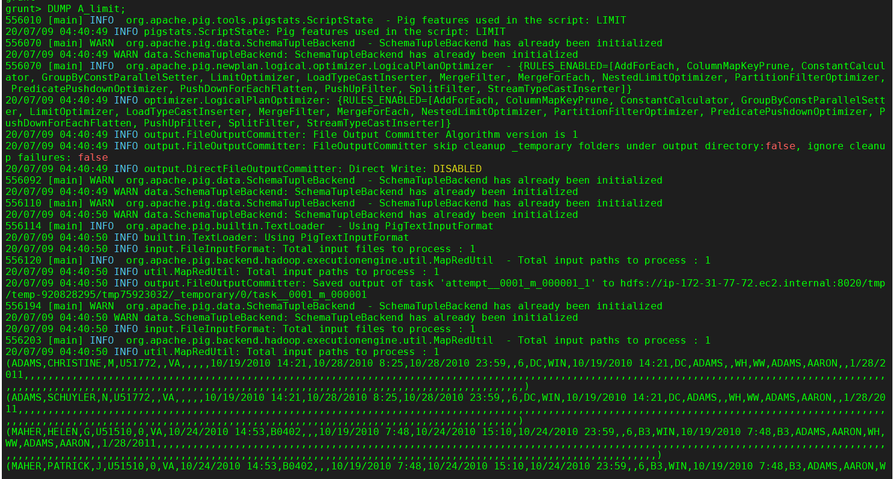

4. Define a Schema
    1. Load whitehouse data again, but this time we use PigStorage loader and define a partial schema 

    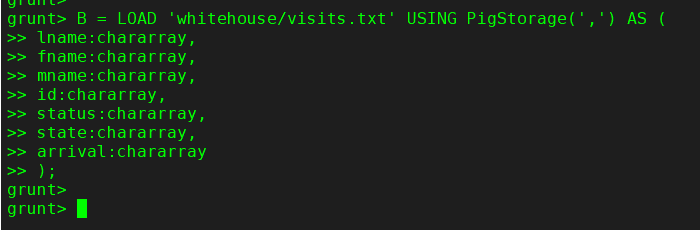

    2. Use 'Describe B' to view the schema

    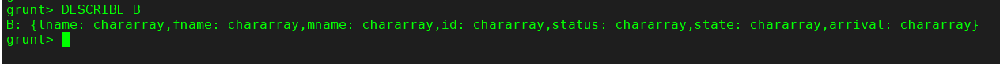

5. The STORE command
    1. Use STORE command, which stores the B relation into a folder named whouse_tab and seperates the fields of each record with tabs 

    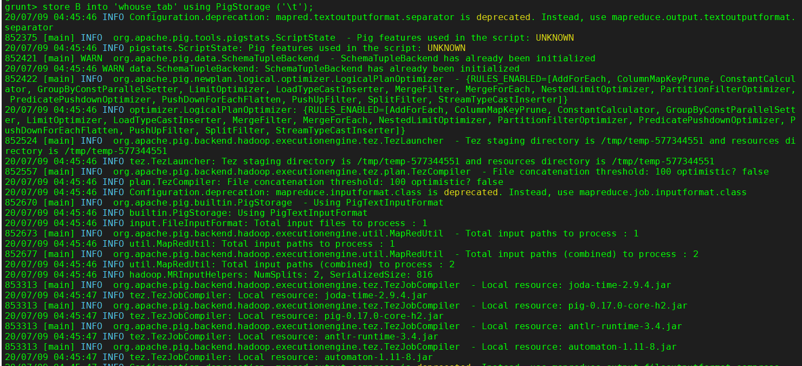

    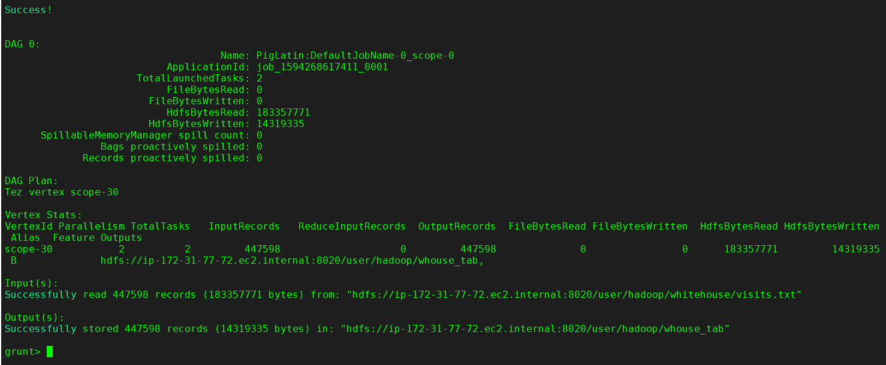

    2. Verify that whouse_tab folder was created. You should see 2 mapped output files.

    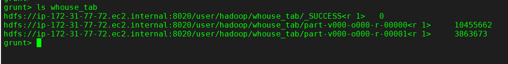

    3. View one of the output files to veriy they contain the B relation in a tab-delimited format

    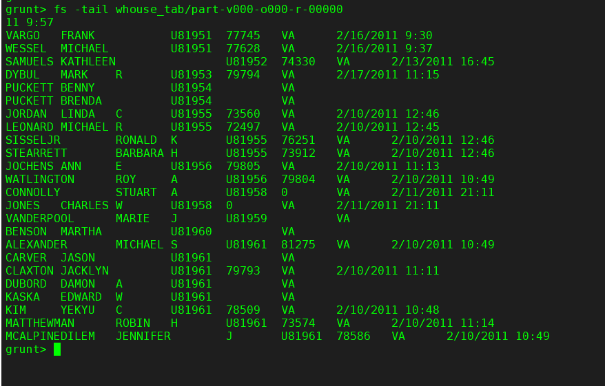

    4. Each record should contain seven fields. What happened to the rest of the fields from the raw data that was loaded from whitehouse/visits.txt?

        ***Answer***: They were simply ignored when each record was read in from HDFS.

6. Use a different Storer
    1. In the previous step, you stored a relation using PigStorage with a tab delimiter. Enter the following command, which stores the same relation but in a JSON format: 

    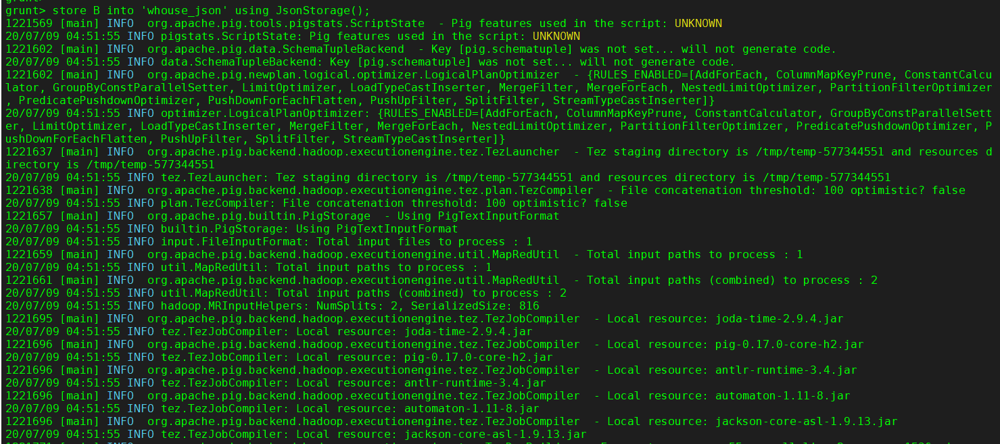

    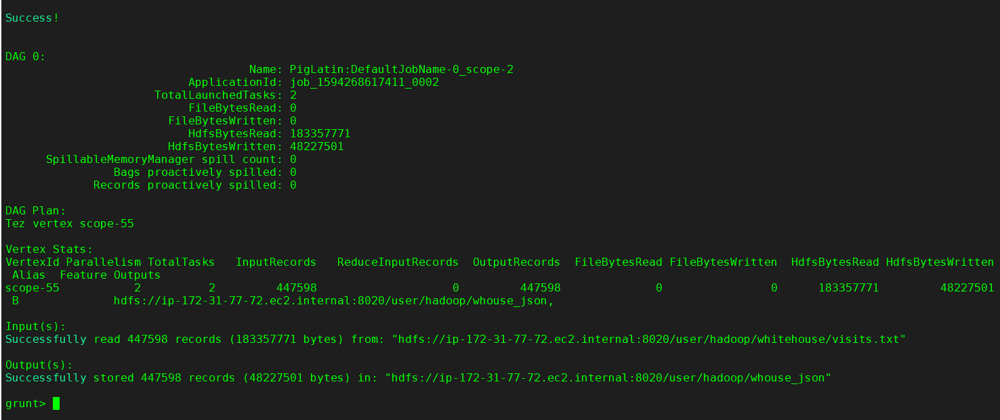

    2. Verify that whouse_json folder was created

    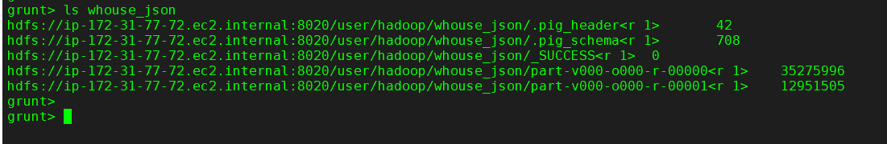

    3. View one of the output files

    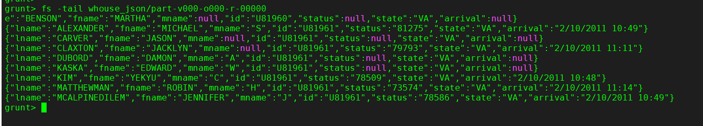

***Result -> You have now seen how to execute some basic Pig commands, load data into a relation, and store a relation into a folder in HDFS using different formats.***
