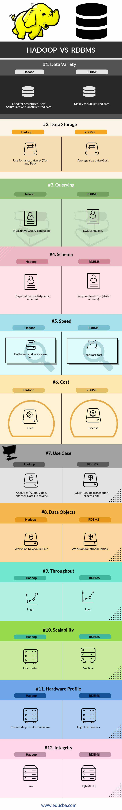

#DAY 1 -> INTRODUCTION TO BIG DATA

***Q1 -> What is Big Data?***

***Answer:-***

    According to Gartner,
    Big data is high-volume, high-velocity and high-variety information assets that demand cost-effective, innovative forms of information processing for enhanced insight and decision making.

    Charateristics of Big Data can be described wtih the help of 5 V's :-

    * Volume: Machine generated data is produced in larger quantities than non traditional data.

    * Velocity: Speed rate in collecting or acquiring or generating or processing of data

    * Variety: This refers to large variety of input data which in turn generates large amount of data as output.

    * Veracity – How accuracy/meaningful/trustworthy are the results to the given problem space. 

    * Value – Useful Business value extracted out of big data.

***Q2 -> Industry use cases***

***Answer:-***

    * Financial Analysis
    * Social Media Monitoring
    * Anomaly Detection
    * Fraud Detection
    * Cybersecurity
    * Cloud Monitoring
    * Brain Network Analysis

***Q3 -> Big Data challenges***

***Answer:-***

    * Traditional RDBMS – fails to handle BIG DATA
    * BIG DATA cannot fit in the memory of a single computer
    * Processing is time consuming
    * Scaling with the traditional RDBMS is expensive

***Q4 -> Solution to Big Data problems***

***Answer:-***

    * Distributed storage across multiple disks
    * Implement Parallel Processing
    * Bring the code to the data for processing instead of bringing data to code.

***Q5 -> Hadoop Distributions and Vendors***

***Answer:-***

    1) Amazon Elastic MapReduce
    2) Cloudera CDH Hadoop Distribution
    3) Hortonworks Data Platform (HDP)
    4) MapR Hadoop Distribution
    5) IBM Open Platform
    6) Microsoft Azure's HDInsight - Cloud based Hadoop Distrbution

***Q6 -> Introduction to Hadoop***

***Answer:-***

    The Apache Hadoop software library is a framework that allows for the distributed processing  of large data sets across clusters of computers using simple programming models. It is  designed to scale up from single servers to thousands of machines, each offering local  computation and storage. Rather than rely on hardware to deliver high-availability, the  library itself is designed to detect and handle failures at the application layer, so delivering  a highly-available service on top of a cluster of computers, each of which may be prone to  failures.

    The project includes these modules:
        * Hadoop Common: The common utilities that support the other Hadoop modules.
        * Hadoop Distributed File System (HDFS™): A distributed file system that provides high-  throughput access to application data.
        * Hadoop YARN: A framework for job scheduling and cluster resource management.
        * Hadoop MapReduce: A YARN-based system for parallel processing of large data sets

***Q7 -> A Brief History of Hadoop***

***Answer:-***

    According to its co-founders, Doug Cutting and Mike Cafarella, the genesis of Hadoop was the Google File System paper that was published in October 2003. This paper spawned another one from Google – "MapReduce: Simplified Data Processing on Large Clusters". Development started on the Apache Nutch project, but was moved to the new Hadoop subproject in January 2006. Doug Cutting, who was working at Yahoo! at the time, named it after his son's toy elephant. The initial code that was factored out of Nutch consisted of about 5,000 lines of code for HDFS and about 6,000 lines of code for MapReduce.

    In March 2006, Owen O’Malley was the first committer to add to the Hadoop project; Hadoop 0.1.0 was released in April 2006. It continues to evolve through contributions that are being made to the project.

***Q8 -> Evolution of Hadoop***

***Answer:-***

***Q9 -> Comparison with Legacy Systems like RDBMS***

***Answer:-***

